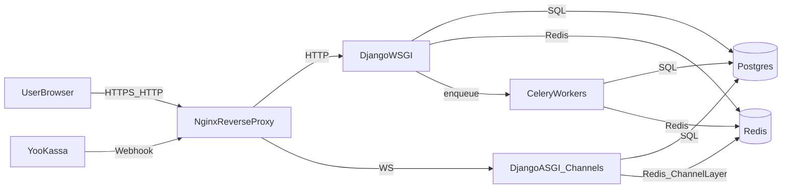

# Threat model: ProMaster (Django/DRF/Channels)

Дата: 2026-04-21  
Версия: v0.1 (первичная модель угроз по коду репозитория)

## 1) Контекст и границы системы

### 1.1 Компоненты
- **Web (HTTP)**: Django (WSGI) — `config/wsgi.py`
- **Realtime (WebSocket)**: Django Channels (ASGI) — `config/asgi.py`, `apps/chat/*`
- **Background**: Celery worker/beat — задачи (bookings/billing/reviews/chat)
- **Хранилища**:
  - PostgreSQL/PostGIS — основной источник данных (ПДн, заказы, чаты)
  - Redis — кэш/сессии/hold слотов/ограничения (rate limit чата), channel layer
- **Интеграции**:
  - YooKassa webhook — `apps/billing/views.py`
  - SMS backend (OTP/уведомления) — `apps/users/sms.py`
  - reCAPTCHA (login) — `apps/users/views.py`

### 1.2 Роли (актеры)
- **Anonymous**: неавторизованный пользователь
- **Client**: клиент (создание брони, чат по брони, отзывы)
- **StoOwner**: владелец СТО (кабинет, управление бронированиями, чат)
- **ErpAdmin**: администратор ERP (`secure-erp/`)
- **DjangoAdmin**: админка Django (`secure-admin/`)
- **PaymentProvider**: провайдер платежей (YooKassa)
- **Attacker**: внешний злоумышленник, в т.ч. ботнет/скрипт-кидди/целевая атака

### 1.3 Критические активы
- **ПДн**: ФИО/телефон/адрес, VIN/госномер, история заказов, сообщения чата, отзывы.
- **Учётные записи**: сессии, пароли (hash), роли, доступы StoOwner/ErpAdmin.
- **Платёжные события**: вебхуки, статусы подписки СТО, идемпотентность провайдера.
- **Надёжность**: удержание слотов (Redis), чат (WS), доступность API.

## 2) Data Flow Diagram (DFD) — укрупнённо

Границы доверия:
- Внешняя сеть (интернет) до Nginx
- Внутренняя сеть/контейнерная сеть между Nginx ↔ Django ↔ Redis/Postgres
- Внешние интеграции (YooKassa, SMS, reCAPTCHA)

## 3) STRIDE-угрозы по основным потокам

### 3.1 Аутентификация/сессии (HTTP + WS)
- **S (Spoofing)**: кража сессии (cookie), фиксация сессии, подбор пароля/credential stuffing.
- **T (Tampering)**: подмена CSRF/headers, попытки обхода проверок роли.
- **R (Repudiation)**: отсутствие достаточного аудита действий администратора/владельца СТО.
- **I (Information disclosure)**: утечки ПДн через логи/ошибки/IDOR.
- **D (DoS)**: брутфорс логина, флад чата/эндпоинтов.
- **E (Elevation)**: доступ к `secure-admin/` или `secure-erp/` без прав; горизонтальное повышение (IDOR).

### 3.2 Бронирования/слоты (бизнес-логика)
- **T**: создание брони на занятое время через гонку/обход hold-механизма.
- **D**: массовое создание/отмена бронирований, перегрузка Redis/DB.
- **E**: изменение брони/статуса чужого заказа (IDOR).

### 3.3 Чаты (WebSocket + HTTP)
- **S**: подключение к WS без auth (должно быть закрыто), кража session cookie.
- **E/IDOR**: подключение/отправка в чужую комнату по `booking_id`/`thread_id` (room enumeration).
- **I**: XSS через сообщения/отзывы (stored/DOM XSS), утечки в payload/шаблоны.
- **D**: флад сообщений (rate-limit), зависимость от Redis, разрастание таблиц сообщений.

### 3.4 Платежи (YooKassa webhook)
- **S/T**: подделка вебхука без валидной подписи.
- **R**: повторы событий (replay) и отсутствие идемпотентности.
- **I**: логирование payload с чувствительными данными.
- **E**: неверная привязка `station_id`/подписки (tampering metadata).

## 4) Безопасностные требования (security requirements)

### 4.1 Минимальные тех. меры
- Везде HTTPS; корректная работа behind-proxy (secure cookies, CSRF, forwarded headers).
- Центральная политика секретов: **не хранить секреты в git**, только env/secret store.
- Жёсткая авторизация для всех сущностей, содержащих ПДн (client/owner scoping).
- Контроль скорости: login, чат, создание брони, вебхуки (на уровне приложения + Nginx).
- Логи: запрет ПДн/OTP/токенов, маскирование идентификаторов, доступ по принципу need-to-know.

### 4.2 Для 152‑ФЗ (техническая часть)
- Минимизация и ограничение доступа к ПДн.
- Журналирование админских действий, контроль целостности.
- Шифрование бэкапов (уже есть `age`), шифрование на носителе/в БД (инфра‑требование).
- Механизм удаления/анонимизации по запросу субъекта.

## 5) Тестовые сценарии (security test cases)
- IDOR: перебор booking_id/chat thread_id и попытка прочитать/писать без участия в сущности.
- Brute force: многократные логины → проверка axes + rate-limit на Nginx.
- CSRF: POST на критичные endpoints из чужого origin.
- XSS: попытки внедрения в отзыв/сообщение/имя — проверка экранирования.
- Webhook: поддельная подпись/повтор event_id → должно отклоняться/быть идемпотентным.

